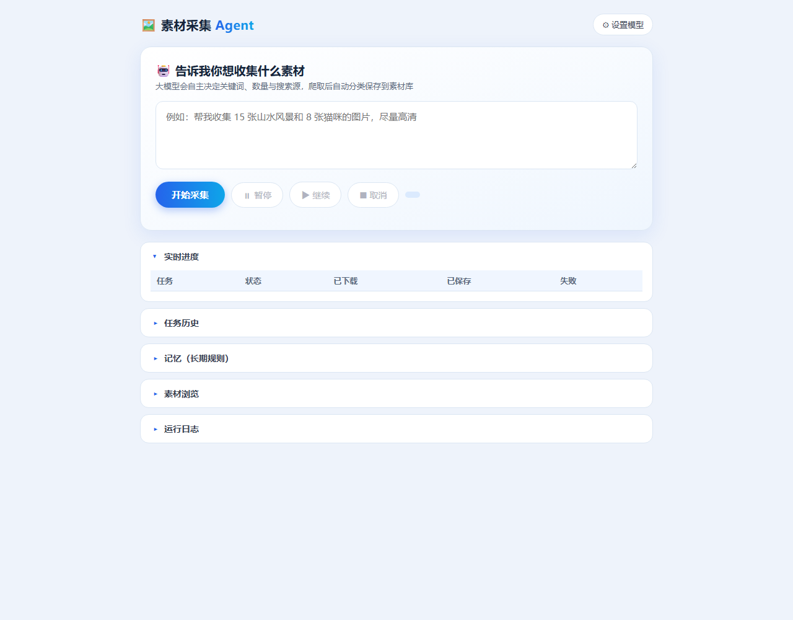

# 素材采集 Agent · 使用说明

> 素材采集智能体：一句话下达需求，大模型自主选词选源，爬取图片、内容校验、分类保存；内置跨会话语义记忆。



## 📖 项目简介

**素材采集智能体（Material Collection Agent）** 是一个基于 **大模型工具调用（Agent / Function Calling）** 的本地应用。

你不再需要手动输入一个个关键词、逐个下载图片。你只需要**用一句自然语言描述想要什么素材**，Agent 就会像一位智能助手一样：

1. **理解意图** —— 解析你的需求，拆解出要采集的主题、数量、方向；
2. **自主规划** —— 决定用哪些关键词、每个采几张、用哪个搜索源；
3. **执行采集** —— 调用工具从网上爬取图片，逐张做**多模态内容校验**，把不相关的图过滤掉；
4. **分类保存** —— 按关键词自动创建文件夹，去重、重名加序号，存到本地素材库；
5. **总结反馈** —— 跑完用中文汇报采了哪些、各多少张、失败情况，并可自主换源重试。

同时，它带有**跨会话长期记忆**，能记住你的偏好与历史，越用越懂你。

---

## ✨ 核心功能

### 🤖 Agent 智能体
- 大模型作为**决策者**，在循环里自主选择调用工具（`collect_keyword` / `collect_url` / `list_saved`）。
- 根据工具返回结果**动态调整策略**：结果太少就换关键词、换搜索源、调整数量或尺寸过滤。
- 每步决策都由大模型完成，而不是写死的脚本。

### ✅ 内容校验（提升命中率）
- 下载每张图后，让多模态模型识别内容，并**判断是否真的与关键词相关**。
- 不相关的图（如搜「零食」混入「鸟类」广告图）**直接丢弃**，避免素材库出现「图文不符」。
- 识别失败时默认放行，避免误删正确图片。

### 🧠 跨会话记忆（语义 RAG）
- 用火山方舟 **embedding** 模型把记忆向量化，每次采集按「用户目标」做**语义相似度检索**，只取最相关的记忆注入提示词。
- **自动去重**：新增规则与已有规则语义相似度过高时拒收。
- **自动遗忘**：记录使用次数与最近使用时间，自动清理长期没用到的冷门规则。

### 🖼️ 多源采集
- 搜索源可切换：**Bing**（免 Key）/ **Pixabay** / **Pexels**（填 Key）。
- 未配置 Key 的源自动回退 Bing；支持从指定网页 URL 提取图片。

### 📂 自动分类保存
- 目录结构：`素材库/关键词/图片`。
- 命名：`01_关键词.jpg`；**MD5 内容去重**；重名自动加序号。
- 只保存 `.jpg/.jpeg/.png`、单张 ≤1MB、不含动图。

### 💻 本地网页界面
- 一句话输入框下达任务；**实时进度**表格。
- **暂停 / 继续 / 取消**（取消有二次确认）；任务完成**提示音**。
- **结果报告**（可导出 txt）、**任务历史**回查、**素材缩略图浏览**、**记忆管理**面板。

---

## 🧩 架构与技术栈

```
用户一句话 ──► Flask 后端(app.py) ──► Agent 编排(agent.py)
                                        │ 调用工具
                                        ▼
                              ┌─ collect_keyword ─► crawler.py（搜索/下载）
                              ├─ collect_url     ─► crawler.py（网页提取）
                              └─ list_saved      ─► 素材库浏览
                                        │
                                        ▼
                              classifier.py（多模态识别 + 内容校验）
                                        │
                                        ▼
                              saver.py（去重 / 重名 / 保存）
                                        │
                                        ▼
                              素材库/关键词/图片
                                        ▲
                     memory.py（跨会话语义记忆，注入提示词）
```

- **语言/框架**：Python 3.9+，Flask 网页后端。
- **依赖**：`flask`、`requests`、`pyyaml`、`pillow`。
- **模型**：OpenAI 兼容多模态接口（默认火山引擎 Agent Plan 套餐）。

---

## 🚀 部署环境

- **Python**：3.9 及以上（Windows / macOS / Linux 均可）。
- **依赖安装**：
  ```bash
  pip install -r requirements.txt
  ```
- **模型要求**：需要一个大模型 API Key，支持图片输入 + 工具调用。
  - 本项目默认用**火山引擎 Agent Plan 套餐**（`/api/plan/v3` + `doubao-seed-2-1-turbo-260628`）。
  - 也可换成任意 OpenAI 兼容多模态接口（在 `config.yaml` 或页面「设置模型」配置）。
  - 记忆模块用 embedding 模型（默认 `doubao-embedding-vision-251215`），不可用时自动降级。
- **网络**：爬图与调用模型都需要联网。

### 快速开始
```bash
# 1. 配置（复制模板并填写你的 API Key）
cp config.example.yaml config.yaml

# 2. 安装依赖
pip install -r requirements.txt

# 3. 启动
python app.py

# 4. 浏览器打开
# http://127.0.0.1:5000
```

---

## 📁 目录结构

| 文件 | 作用 |
|---|---|
| `app.py` | Flask 后端入口与路由 |
| `pipeline.py` | 采集管线（并行下载/两级过滤/保存） |
| `task_state.py` | 任务状态 / 锁 / 事件 / 日志缓冲 |
| `utils.py` | 公共工具（Base URL 归一化） |
| `agent.py` | Agent 编排（大模型工具调用循环） |
| `crawler.py` | 搜索(Bing/Pixabay/Pexels) + URL 提取 + 下载 + 尺寸 |
| `classifier.py` | 多模态识别 + 关键词匹配校验 |
| `saver.py` | 保存 / MD5 去重 / 重名加序号 |
| `memory.py` | 跨会话记忆（语义 RAG：检索/去重/遗忘） |
| `logger_setup.py` | 日志配置 |
| `config.yaml` / `config.example.yaml` | 运行配置（含密钥的 config.yaml 已 gitignore） |
| `memory.json` / `memory_vectors.json` | 记忆数据与向量缓存（运行时生成） |
| `templates/index.html` | 网页界面 |
| `素材库/` `logs/` | 图片输出与日志（运行时生成） |

---
## 一、核心特性

- 🤖 **Agent 智能体**：一句话下达需求，大模型自主决策 + 调用工具（`collect_keyword` / `collect_url` / `list_saved`）循环采集，跑完自动总结。
- ✅ **内容校验（命中率）**：下载后让多模态模型判断「图片是否真的对得上关键词」，不相关的直接丢弃，避免搜「零食」存成「鸟类」。
- 🧠 **跨会话记忆（语义 RAG）**：用火山方舟 embedding 模型把记忆向量化，每次采集按「用户目标」语义检索最相关的历史规则并注入提示词；自动去重、自动遗忘冷门规则。
- 📂 **单级分类保存**：`素材库/关键词/图片`，命名 `01_关键词.jpg`，MD5 去重、重名自动加序号。
- 🖼️ **只存合规图**：仅 `.jpg/.jpeg/.png`、单张 ≤1MB、不含动图。
- 🌐 **多搜索源**：Bing（免 Key）/ Pixabay / Pexels（填 Key）可切换。
- 💻 **本地网页界面**：实时进度、暂停 / 继续 / 取消（取消有二次确认）、任务完成提示音、结果报告、历史回查、素材缩略图浏览、记忆管理。

---

## 二、目录结构

```
agent/
├── app.py               # Flask 后端入口
├── pipeline.py          # 采集管线（并行下载/两级过滤/保存）
├── task_state.py        # 任务状态 / 锁 / 事件 / 日志缓冲
├── utils.py             # 公共工具（Base URL 归一化）
├── agent.py             # Agent 编排（大模型工具调用循环）
├── crawler.py           # 搜索(Bing/Pixabay/Pexels) + URL 提取 + 下载 + 尺寸
├── classifier.py        # 多模态识别 + 关键词匹配校验（analyze）
├── saver.py             # 保存 / MD5 去重 / 重名加序号
├── memory.py            # 跨会话记忆（语义 RAG：检索/去重/遗忘）
├── logger_setup.py      # 日志
├── config.yaml          # 运行配置（模型 / 搜索源 / 过滤）
├── memory.json          # 长期记忆规则（可跨会话累积）
├── memory_vectors.json  # 记忆向量缓存（自动生成）
├── requirements.txt
├── templates/index.html # 网页界面
├── 素材库/              # 运行时自动创建，存图片
└── logs/                # 运行时自动创建（history.json + 时间戳日志）
```

---

## 三、安装

需要 **Python 3.9+**（本机用 Anaconda 即可）。

```bash
pip install -r requirements.txt
```

依赖：`flask`、`requests`、`pyyaml`、`pillow`。

> 在 PyCharm 中直接打开项目，用 `app.py` 作为入口运行即可（推荐）。

---

## 四、配置

> 首次使用：复制 `config.example.yaml` 为 `config.yaml` 再填写你的 API Key。
> `config.yaml` 已在 `.gitignore` 中，**不会**被提交到 GitHub，避免泄露密钥。

### 1. 模型（LLM）—— 关键

本项目用的是**火山引擎 Agent Plan 套餐**，必须用**套餐接口**和**套餐内模型**：

在 `config.yaml` 的 `llm` 段：

```yaml
llm:
  base_url: "https://ark.cn-beijing.volces.com/api/plan/v3"   # 套餐接口（勿用 /api/v3）
  api_key: "你的套餐 API Key"
  model: "doubao-seed-2-1-turbo-260628"      # 套餐内多模态模型
  embedding_model: "doubao-embedding-vision-251215"  # 记忆向量化模型
```

- ⚠️ 套餐 Key 配 `/api/v3` 会报 401/404；必须用 `/api/plan/v3`。
- 页面「⚙ 设置模型」可填，会存到浏览器 `localStorage` 并**覆盖** `config.yaml`。若之前存过旧配置导致报错，清一下：浏览器 `F12` → Console → `localStorage.removeItem('material_agent_llm')` → 刷新。

### 2. 搜索源

```yaml
search:
  provider: "bing"        # bing | pixabay | pexels
  pixabay: { api_key: "" }   # https://pixabay.com/api/docs/
  pexels:  { api_key: "" }   # https://www.pexels.com/api/
```
默认 `bing` 免 Key；未配 Key 的源会自动回退 Bing。Pixabay / Pexels 版权更清晰，建议填 Key 使用。

### 3. 过滤规则

```yaml
save:
  root_dir: "素材库"
  max_size_kb: 1024         # 单张最大 1MB
  allowed_exts: [".jpg", ".jpeg", ".png"]
  count_per_keyword: 20     # 默认每关键词张数

filter:
  min_width: 0              # 小于此宽度跳过；0 不限制
  min_height: 0
  exclude_topics: []        # 不保存的主题词，如 ["文字","截图"]
```

---

## 五、运行

**PyCharm**：打开项目 → 右键运行 `app.py`。

**命令行**：
```bash
python app.py
```

浏览器打开 `http://127.0.0.1:5000`。

---

## 六、使用方法（页面）

1. **下达任务**：在顶部输入框写一句话，例如「收集 15 张山水风景和 8 张猫咪的图片，尽量高清」。
2. **开始采集**：点「开始采集」。可随时「⏸ 暂停 / ▶ 继续 / ⏹ 取消」（取消有二次确认）。
3. **查看进度**：「实时进度」表格展示每个关键词的下载/保存/失败数。
4. **结果与历史**：「结果汇总」可导出报告；「任务历史」可回查以往任务。
5. **浏览素材**：「素材浏览」按关键词/主题查看缩略图，点击放大。
6. **管理记忆**：「记忆（长期规则）」面板可查看、添加、删除让 Agent 长期记住的规则（跨会话生效）。
7. **配置模型**：「⚙ 设置模型」切换预设 / 填 Base URL、API Key、模型名。

图片保存位置：项目下的 `素材库/关键词/图片`。

---

## 七、跨会话记忆（记忆模块）

- **存什么**：长期规则（`memory.json`）+ 近期任务历史（`logs/history.json`）。
- **怎么用**：每次采集前，用 embedding 把「用户目标」和所有记忆做语义相似度排序，只取最相关的 top-K 条注入系统提示（语义 RAG）。
- **自动去重**：新规则与已有规则语义余弦 ≥0.72 或重叠系数 ≥0.75 时拒收。
- **自动遗忘**：规则记录使用次数与最近使用时间，每天自动清理「90 天没用 + 用 <2 次」的冷门规则。
- **降级兜底**：embedding 不可用时自动回退本地 TF-IDF 检索。

---

## 八、接口速览

| 方法 | 路径 | 说明 |
|---|---|---|
| GET | `/` | 页面 |
| GET | `/api/config` | 配置（模型/预设/搜索源） |
| POST | `/api/agent/start` | 启动 Agent 任务（body: `{goal, preset?}`） |
| GET | `/api/status` | 运行状态与进度 |
| POST | `/api/pause` `/api/resume` `/api/cancel` | 暂停 / 继续 / 取消 |
| GET | `/api/report` `/api/export` | 结果汇总 / 导出 txt |
| GET | `/api/history` `/api/history/<id>` | 任务历史 / 详情 |
| GET | `/api/memory` | 记忆查看 |
| POST | `/api/memory` | 新增记忆规则（body: `{rule}`） |
| DELETE | `/api/memory` | 删除记忆规则（body: `{rule}`） |
| GET | `/api/browse` | 素材库树 |
| GET | `/media/<path>` | 图片文件 |

---

## 九、常见问题

- **端口被占 / 页面是旧配置**：之前可能有多个 `app.py` 实例。全部关掉后重启一个即可。
- **报 401/404**：`base_url` 必须是 `/api/plan/v3`（套餐），且 `api_key` 是套餐 Key；或清一下页面 localStorage 旧配置。
- **图片和关键词不符**：已内置内容校验，不相关的会自动丢弃；若仍不满意可调低 `filter` 或换更干净的素材源。
- **搜索慢 / 张数不够**：Bing 免 Key 但稳定性一般，建议给 Pixabay / Pexels 配 Key。
- **需要联网**：爬图与调用模型都要联网。

---

## 十、说明与局限

- 默认 Bing 为 HTML 解析，可能随站点改版失效。
- 版权：优先免费可商用来源，具体图源版权请自行判断。
- 当前为单智能体 + 工具调用形态，自主性上限 `max_iter=15`；无多智能体协作。


---

## 🔧 8.31 优化

2026-08-31 对项目做了一轮系统性优化（完整清单见 `docs/优化清单.md`），共 13 项，分三批完成：

### Bug 修复
- **Content-Type 校验修复**：非图片响应（如 HTML 错误页）直接拒绝，不再被误当图片下载。
- **去重顺序修复**：写盘成功后才记录 MD5 去重，避免写盘失败导致图片被永久误判重复。
- **去重持久化优化**：`.dedup.json` 改为任务结束统一写入，不再每存一张图全量重写。
- **失败补位**：搜索候选扩大到 count×3，保存够数才停止，实际保存数量不再"缺斤短两"。

### 性能提升
- **并行下载与校验**：采集流程改为线程池并行（默认 4 并发，可在 config 配置），整体耗时下降约 60%+。
- **两级内容过滤**：多模态 LLM 校验前先查 MD5 去重，重复图零成本跳过；校验结果按图片 MD5 持久化缓存，同一图片跨任务、跨会话不再重复调用模型，显著降低 token 成本。
- **Bing 失效检测**：连续解析为空时自动告警，提示切换 Pixabay / Pexels 稳定源。

### 架构与可维护性
- **模块拆分**：新增 `pipeline.py`（采集管线）与 `task_state.py`（任务状态/事件/日志），`app.py` 只保留路由与调度。
- **公共工具抽取**：Base URL 归一化收敛到 `utils.py`，消除 3 处重复代码。
- **任务队列**：运行中再提交任务自动排队，完成后依次执行，接口返回队列位置。
- **Agent 轮次可配置**：`max_iter` 移入 `config.yaml`，达到上限后让模型补一次总结而非静默结束。

---

## 🚀 9.1 优化（v3.0：Agent 能力深化）

2026-09-01 完成（规划见 `docs/v3.0优化规划.md`）：

- **Plan-and-Execute 架构**：Agent 从单循环决策升级为「规划 → 执行 → 反思/重规划 → 总结」三段式——先输出结构化采集计划，某步保存不足时自动反思并重规划（换关键词/换源/调数量），规划失败自动回退单循环模式。
- **决策链路追踪与可视化**：每轮 plan / tool_call / tool_result / reflect / replan / final 及 token 用量写入 `logs/traces/<run_id>.jsonl`；网页端新增「决策链路」面板实时展示，支持完整 trace 查询（`/api/trace/<run_id>`）。
- **成本看板**：任务历史记录汇总每次运行的 LLM token 用量，历史表格直接可见。
- **评测体系**：`evals/` 内置 20 例评测集与自动化脚本，输出成功率 / 足额率 / 抽检命中率 / 平均耗时 / 平均 token，支持版本间回归对比。
